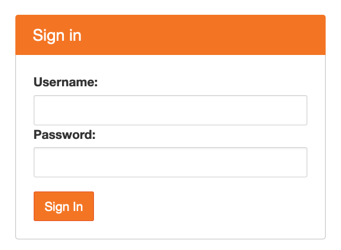
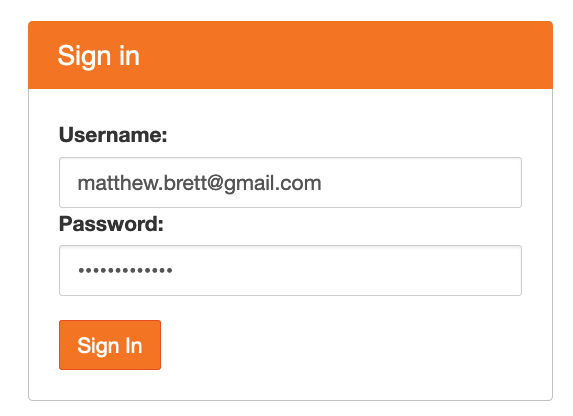
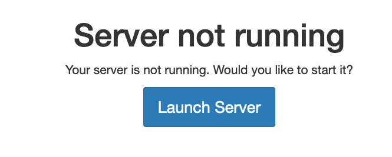

# TALMO example and exercise

## Now the workshop is over

Go to <https://mybinder.org/v2/gh/matthew-brett/talmo/master?filepath=talmo.ipynb>.  Wait a little, and the notebook will appear, and you can interact with it.

The link above uses the public and free [Binder](https://jupyter.org/binder)
project to run the notebook on a very cheap Google cloud computer.

## For more substantial setups

The service above is free, and rather slow.  The more likely practical
situation is where you have enough money to pay for some cloud resources, and
you need start-up times to be reasonably fast, and where you need considerable
flexibility in configuration.

The workshop setup was a basic [JupyterHub on
Kubernetes](https://zero-to-jupyterhub.readthedocs.io) system, running on
credits donated by Google, although the system could just as well have run on
Microsoft Azure or Amazon Web Services (see the link above).  The linked
document describes the setup steps, which are a little advanced.   The system
that results consists of a cluster of cloud machines, that can scale up and
down as more or less people use it; it should be able to handle very large
numbers of students.

In my hands, this kind of system was costing about \$13 per day to keep
running, without any students logging in.  The rest of the cost is students
using the system, and that will depend on how many students there are, and how
long they use the system for. For example, at time of writing, in the Google UK
cloud, a `n1-standard-2` machine costs \$0.12 an hour, and would support around
four students, so cost will be a little more than 3c per student per hour that
they are using the system, allowing for the fact that some machines will be
partially used.  You will also need to pay to keep the students' disk storage
running; how much will depend on the kind of storage, and how much storage you
allocate per student.

In fact the scaling up process on the cluster failed on the workshop day,
presumably due to my relative inexperience in configuration; see [my subsequent
question on the help
forum](https://discourse.jupyter.org/t/scheduler-insufficient-memory-waiting-errors-any-suggestions/5314)
for some idea of what debugging looks like for this kind of system.

You can also set a system up on a fairly significant single server machine
using [these steps](https://tljh.jupyter.org); this can be a cloud machine or a
beefy machine on your desktop.  These setups won't scale very well to more than
100 students.  If you are using an always-on cloud server, they will also tend
to be more expensive, because you need a machine with lots of CPU and memory up
and running all the time.

If you're interested in setting up a system like this, I am happy to help, if
only to act as a [rubber duck debugging tool](https://rubberduckdebugging.com).
The [JupyterHub discourse fora](https://discourse.jupyter.org) will put you in
touch with the real experts.

## Instructions during the workshop

**These instructions will not work, because I have since shut down the server
that I set up for the workshop**.

To run this example in the session, you will have needed the following
password:

```
talmoworkshop
```

Armed with this password, you would have gone to this link
<https://hub.dynevor.org/user/matthew-brett/git-pull?repo=https%3A%2F%2Fgithub.com%2Fmatthew-brett%2Ftalmo&subPath=talmo.ipynb>.

You might have seen a browser window like this:



You entered *your email address* as your username, and used the password above:



You clicked Launch Server when you got that option:


